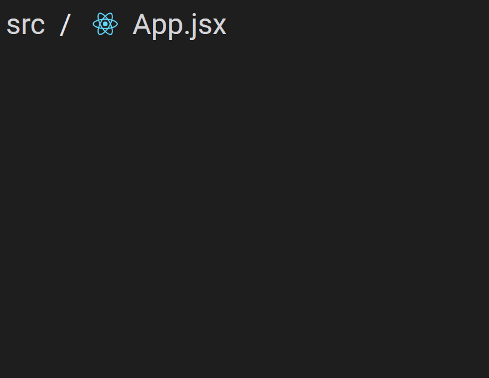
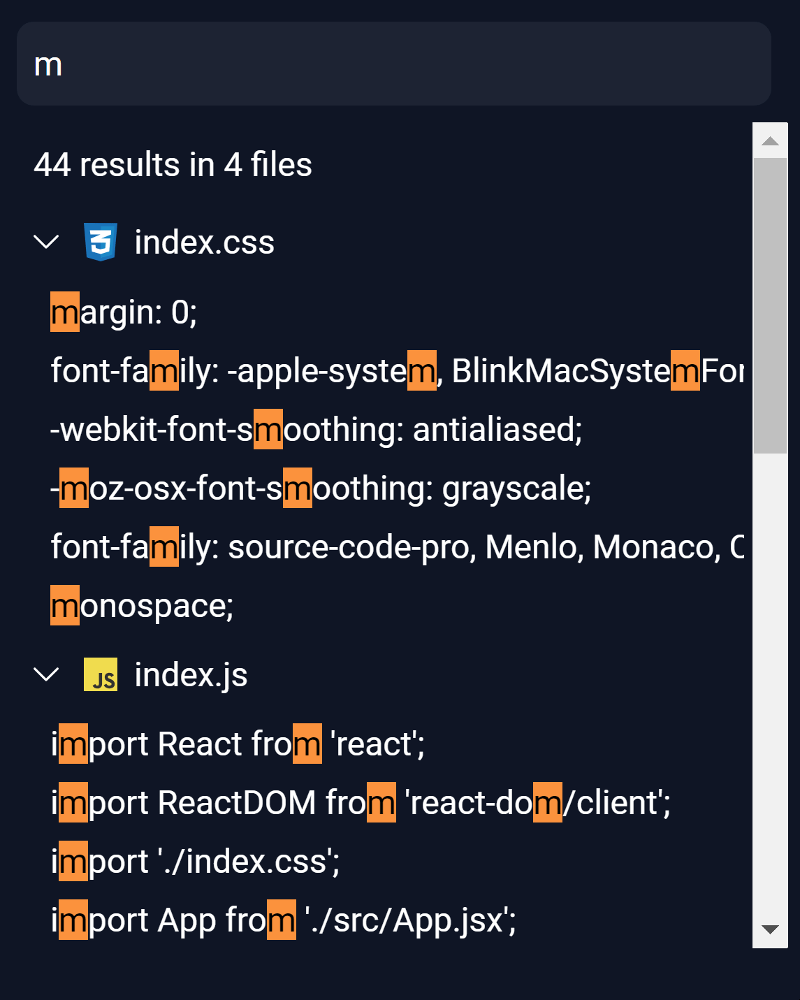

# @litecode-ide/virtual-file-system

**@litecode-ide/virtual-file-system** (from here onwards referred to as **_VFS_**) is an extensible, browser-based file system.

## Installation

Use the package manager [npm](https://www.npmjs.com/) to install VFS.

```bash
npm install @litecode-ide/virtual-file-system
```

## Simple Usage

```js
import React from "react";
import ReactDOM from "react-dom/client";

import { FileExplorer } from "@litecode-ide/virtual-file-system"; // FileExplorer component
import "@litecode-ide/virtual-file-system/dist/style.css"; // Default styles

const App = () => {
  return (
    <>
      <FileExplorer validExtensions={["html", "css", "js"]} />
    </>
  );
};

const root = ReactDOM.createRoot(document.getElementById("root"));
root.render(<App />);
```

To use logos with file types, create a css class `[extension]-logo`

```css
.html-logo {
  background-image: url("./assets/html.svg");
}
```

You can clone a more detailed example from [GitHub](https://github.com/LiteCode-IDE/vfs-sample.git). Alternatively run the live example on [CodeSandbox](https://codesandbox.io/p/github/LiteCode-IDE/vfs-sample/main?layout=%257B%2522sidebarPanel%2522%253A%2522EXPLORER%2522%252C%2522rootPanelGroup%2522%253A%257B%2522direction%2522%253A%2522horizontal%2522%252C%2522contentType%2522%253A%2522UNKNOWN%2522%252C%2522type%2522%253A%2522PANEL_GROUP%2522%252C%2522id%2522%253A%2522ROOT_LAYOUT%2522%252C%2522panels%2522%253A%255B%257B%2522type%2522%253A%2522PANEL_GROUP%2522%252C%2522contentType%2522%253A%2522UNKNOWN%2522%252C%2522direction%2522%253A%2522vertical%2522%252C%2522id%2522%253A%2522clqci8er30006356vfnd2iny4%2522%252C%2522sizes%2522%253A%255B70%252C30%255D%252C%2522panels%2522%253A%255B%257B%2522type%2522%253A%2522PANEL_GROUP%2522%252C%2522contentType%2522%253A%2522EDITOR%2522%252C%2522direction%2522%253A%2522horizontal%2522%252C%2522id%2522%253A%2522EDITOR%2522%252C%2522panels%2522%253A%255B%257B%2522type%2522%253A%2522PANEL%2522%252C%2522contentType%2522%253A%2522EDITOR%2522%252C%2522id%2522%253A%2522clqci8er30002356v3zglr9d3%2522%257D%255D%257D%252C%257B%2522type%2522%253A%2522PANEL_GROUP%2522%252C%2522contentType%2522%253A%2522SHELLS%2522%252C%2522direction%2522%253A%2522horizontal%2522%252C%2522id%2522%253A%2522SHELLS%2522%252C%2522panels%2522%253A%255B%257B%2522type%2522%253A%2522PANEL%2522%252C%2522contentType%2522%253A%2522SHELLS%2522%252C%2522id%2522%253A%2522clqci8er30004356vrajed05p%2522%257D%255D%252C%2522sizes%2522%253A%255B100%255D%257D%255D%257D%252C%257B%2522type%2522%253A%2522PANEL_GROUP%2522%252C%2522contentType%2522%253A%2522DEVTOOLS%2522%252C%2522direction%2522%253A%2522vertical%2522%252C%2522id%2522%253A%2522DEVTOOLS%2522%252C%2522panels%2522%253A%255B%257B%2522type%2522%253A%2522PANEL%2522%252C%2522contentType%2522%253A%2522DEVTOOLS%2522%252C%2522id%2522%253A%2522clqci8er30005356vp8n5i57j%2522%257D%255D%252C%2522sizes%2522%253A%255B100%255D%257D%255D%252C%2522sizes%2522%253A%255B40%252C60%255D%257D%252C%2522tabbedPanels%2522%253A%257B%2522clqci8er30002356v3zglr9d3%2522%253A%257B%2522id%2522%253A%2522clqci8er30002356v3zglr9d3%2522%252C%2522tabs%2522%253A%255B%255D%257D%252C%2522clqci8er30005356vp8n5i57j%2522%253A%257B%2522id%2522%253A%2522clqci8er30005356vp8n5i57j%2522%252C%2522activeTabId%2522%253A%2522clqci9sgs00bu356vreccsav2%2522%252C%2522tabs%2522%253A%255B%257B%2522type%2522%253A%2522ENV_SETUP%2522%252C%2522id%2522%253A%2522clqci8etp000o356vpam546dt%2522%252C%2522mode%2522%253A%2522permanent%2522%257D%252C%257B%2522type%2522%253A%2522UNASSIGNED_PORT%2522%252C%2522port%2522%253A5173%252C%2522id%2522%253A%2522clqci9sgs00bu356vreccsav2%2522%252C%2522mode%2522%253A%2522permanent%2522%252C%2522path%2522%253A%2522%252F%2522%257D%255D%257D%252C%2522clqci8er30004356vrajed05p%2522%253A%257B%2522id%2522%253A%2522clqci8er30004356vrajed05p%2522%252C%2522activeTabId%2522%253A%2522clqci8er30003356v0nijrgme%2522%252C%2522tabs%2522%253A%255B%257B%2522id%2522%253A%2522clqci8er30003356v0nijrgme%2522%252C%2522mode%2522%253A%2522permanent%2522%252C%2522type%2522%253A%2522TERMINAL%2522%252C%2522shellId%2522%253A%2522clqci8f5r000redh5hdbxd7po%2522%257D%252C%257B%2522type%2522%253A%2522TASK_LOG%2522%252C%2522taskId%2522%253A%2522dev%2522%252C%2522id%2522%253A%2522clqci8f9w005c356vc7x0fxhk%2522%252C%2522mode%2522%253A%2522permanent%2522%257D%255D%257D%257D%252C%2522showDevtools%2522%253Atrue%252C%2522showShells%2522%253Atrue%252C%2522showSidebar%2522%253Afalse%252C%2522sidebarPanelSize%2522%253A0%257D).

## List of Exported Components

- FileExplorer\
  [](sample/structure.gif)

- BreadCrumbs\
  [](sample/breadcrumbs.gif)

- Tabs\
  [](sample/tabs.gif)

- Search\
  [](sample/search.gif)

## API

VFS comes with a typescript definition file.

```ts
declare module "@litecode-ide/virtual-file-system" {
  type ItemType = "file" | "folder";

  interface BreadcrumbsProps {
    containerClassName?: string;
    textClassName?: string;
    miniFolderCollapseBtnClassName?: string;
    miniFolderCollapseBtnStyle?: React.CSSProperties;
    miniFolderContainerClassName?: string;
    itemTitleClassName?: string;
    onBreadcrumbFileClick?: (id: string) => void;
  }

  interface StructureProps {
    deleteConfirmationClassName?: string;
    fileInputClassName?: string;
    fileInputStyle?: React.CSSProperties;
    contextMenuClassName?: string;
    contextMenuHrColor?: string;
    contextMenuClickableAreaClassName?: string;
    fileActionsBtnClassName?: string;
    projectName?: string;
    fileActionsDisableCollapse?: true;
    fileActionsDisableTooltip?: true;
    fileActionsDisableDownload?: true;
    folderCollapseBtnClassname?: string;
    folderCollapseBtnStyle?: React.CSSProperties;
    folderThreeDotPrimaryClass?: string;
    folderThreeDotSecondaryClass?: string;
    folderClickableAreaClassName?: string;
    folderSelectedClickableAreaClassName?: string;
    folderContextSelectedClickableAreaClassName?: string;
    itemTitleClassName?: string;
    structureContainerClassName?: string;
    containerHeight?: string;
    onItemSelected?: (item: { id: string; type: ItemType }) => void;
    onNewItemClick?: (parentFolderId: string, type: ItemType) => void;
    onAreaCollapsed?: (collapsed: boolean) => void;
    onItemContextSelected?: (item: { id: string; type: ItemType }) => void;
    onNodeDeleted?: (id: string) => void;
    onNewItemCreated?: (id: string) => void;
    validExtensions: string[];
  }

  interface TabsProps {
    containerClassName?: string;
    tabClassName?: string;
    selectedTabClassName?: string;
    onTabClick?: (id: string) => void;
    onTabClose?: (id: string) => void;
  }

  interface MatchingFile {
    id: string;
    name: string;
    extension: string;
    matches: MatchingLine[];
  }

  interface MatchingLine {
    line: number;
    content: string;
  }

  interface SearchResults {
    files: MatchingFile[];
    numOfResults: number;
    numOfLines: number;
  }

  interface SearchInputProps {
    className?: string;
    style?: React.CSSProperties;
    onSearchFiles?: (searchTerm: string, searchResults: SearchResults) => void;
  }

  interface SearchContainerProps {
    highlightedTextClassName?: string;
    headerClassName?: string;
    headerStyle?: React.CSSProperties;
    titleClassName?: string;
    searchResultClicked: (fileId: string, line: number) => void;
  }

  const FileExplorer: React.FC<StructureProps>;
  const TabsList: React.FC<TabsProps>;
  const SearchInput: React.FC<SearchInputProps>;
  const Breadcrumbs: React.FC<BreadcrumbsProps>;
  const SearchResults: React.FC<SearchContainerProps>;
  const updateFile: (id: string, content: string) => void;
  const getFileTree: () => Record<
    string,
    {
      id: string;
      content: string;
    }
  >;
  const getSelectedFile: () => string;

  export {
    FileExplorer,
    TabsList,
    SearchResults,
    Breadcrumbs,
    SearchInput,
    getFileTree,
    updateFile,
    getSelectedFile,
  };
}
```

## Contributing

Pull requests are welcome. For major changes, please open an issue first to discuss what you would like to change.

## License

[MIT](./LICENSE)
