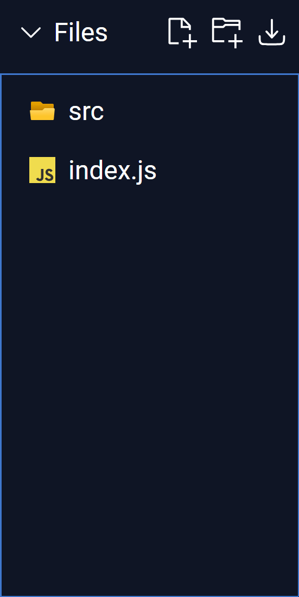

# @litecode-ide/virtual-file-system

**@litecode-ide/virtual-file-system** (from here onwards referred to as **_VFS_**) is an extensible, browser-based file system.

[](sample/structure.gif)

## Installation

Use the package manager [npm](https://www.npmjs.com/) to install VFS.

```bash
npm install @litecode-ide/virtual-file-system
```

## Simple Usage

```js
import React from "react";
import ReactDOM from "react-dom/client";

import { FileExplorer } from "@litecode-ide/virtual-file-system"; // FileExplorer component
import "@litecode-ide/virtual-file-system/dist/style.css"; // Default styles

const App = () => {
  return (
    <>
      <FileExplorer validExtensions={["html", "css", "js"]} />
    </>
  );
};

const root = ReactDOM.createRoot(document.getElementById("root"));
root.render(<App />);
```

## Contributing

Pull requests are welcome. For major changes, please open an issue first to discuss what you would like to change.

## License

[MIT](https://choosealicense.com/licenses/mit/)
